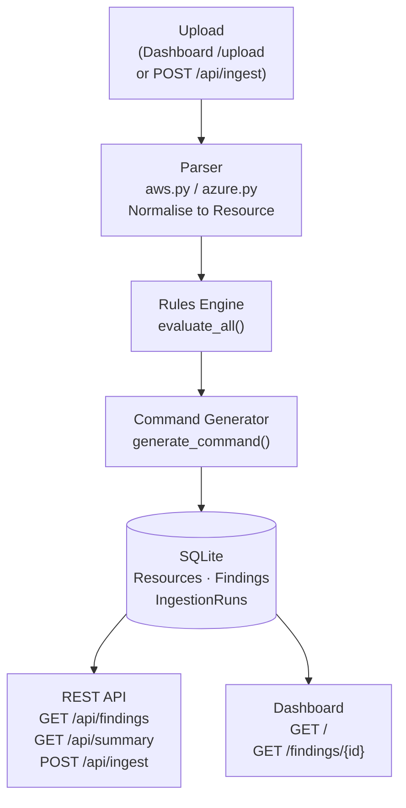

# Cloud Cost Optimizer and Remediation Engine

A FinOps tool that ingests AWS Cost and Usage Reports (CUR) and Azure Cost Management exports, identifies orphaned cloud resources using a rules engine, generates ready-to-review decommission CLI commands, and surfaces everything through a REST API and a server-rendered HTMX dashboard.

---

## Architecture



The ingest pipeline is synchronous within a single request: parse → evaluate all rules → attach commands → persist. The API and dashboard read from the same SQLite database and are fully independent of each other.

---

## Detection Rules

| Rule | Criteria | Severity |
|------|----------|----------|
| **UnattachedVolumeRule** | EBS volume with `lineItem/Operation == CreateVolume-Unattached`; Azure managed disk with `AdditionalInfo.diskState == Unattached` | Medium |
| **IdleComputeRule** | EC2 instance or Azure VM where `avg_cpu_percent < 5` over a period of `≥ 14 days` (read from `raw_export` fields populated during ingestion) | High |
| **UnusedPublicIPRule** | Elastic IP where `lineItem/UsageType` contains `IdleAddress`; Azure public IP where `AdditionalInfo.associatedResource` is null | Low |
| **OldSnapshotRule** | Snapshot whose creation date (resolved from resource tags or `raw_export` fields) is more than 90 days in the past | Low |

Each finding records the specific field values that triggered it (`evidence`), the estimated monthly saving (equal to the resource's `monthly_cost_usd`), and a ready-to-review decommission CLI command.

---

## Running Locally

**Prerequisites:** Python 3.12+, [uv](https://docs.astral.sh/uv/)

```bash
# Clone and install dependencies
git clone <repo-url>
cd "cloud-cost-optimizer"
uv sync

# Start the development server
uv run uvicorn app.main:app --reload
```

The app starts at `http://127.0.0.1:8000`. The SQLite database (`cloud_cost.db`) is created automatically at the repo root on first startup.

To run the test suite:

```bash
uv run pytest
```

---

## Ingesting Sample Data

### Via the dashboard

Navigate to `http://127.0.0.1:8000/upload`, select a provider, and upload a billing export file. On success the browser redirects to the dashboard with findings populated.

### Via curl (API)

**AWS Cost and Usage Report (CSV):**

```bash
curl -X POST http://127.0.0.1:8000/api/ingest \
  -F "provider=aws" \
  -F "file=@sample_data/aws_cur_sample.csv"
```

**Azure Cost Management export (JSON):**

```bash
curl -X POST http://127.0.0.1:8000/api/ingest \
  -F "provider=azure" \
  -F "file=@sample_data/azure_billing_sample.json"
```

The response includes a run summary with resource count, finding count, and run ID. Findings are immediately available via `GET /api/findings` and on the dashboard.

---

## Project Structure

```
app/
├── main.py                  # FastAPI app, lifespan, router registration
├── database.py              # SQLite engine, session factory, get_session dep
├── models/
│   ├── db.py                # SQLAlchemy 2.0 declarative models (Resource, Finding, IngestionRun)
│   └── schemas.py           # Pydantic v2 request/response schemas
├── parsers/
│   ├── aws.py               # AWS CUR CSV → list[Resource]
│   └── azure.py             # Azure billing JSON → list[Resource]
├── rules/
│   ├── engine.py            # Rule ABC + evaluate_all()
│   ├── unattached_volume.py
│   ├── idle_compute.py
│   ├── old_snapshot.py
│   └── unused_public_ip.py
├── commands/
│   └── generator.py         # generate_command(finding, resource) → str
├── api/
│   └── routes.py            # POST /api/ingest, GET /api/findings[/{id}], GET /api/summary
└── web/
    ├── routes.py             # GET /, GET /findings/{id}, GET/POST /upload, GET /findings-table
    └── templates/
        ├── base.html         # Tailwind CDN, HTMX CDN, Chart.js CDN, nav, footer
        ├── index.html        # KPI cards, doughnut chart, HTMX-filtered findings table
        ├── _findings_table.html  # HTMX swap partial (table rows + count)
        ├── detail.html       # Finding detail, evidence JSON, decommission command
        └── upload.html       # File upload form

sample_data/
├── aws_cur_sample.csv        # 50-row AWS CUR 2.0 fixture
├── azure_billing_sample.json # 24-record Azure EA billing fixture
└── README.md                 # Fixture schema notes

tests/
├── test_parsers.py           # Parser normalisation + malformed-input tests
├── test_rules.py             # Per-rule positive and negative cases
├── test_commands.py          # Command string structure assertions
└── test_api.py               # End-to-end integration test (ingest → findings)
```

---

## Styling

The dashboard uses the **Tailwind CSS v4 Play CDN** (`@tailwindcss/browser@4`) for development and demo simplicity — no build step required. Tailwind is configured inline in `base.html` via a `<style type="text/tailwindcss">` block with `@theme` directives (system font stack, slate/sky colour palette). There is no custom CSS file.

> **Production note:** A production deployment would replace the Play CDN with a compiled static asset built via the [Tailwind CLI](https://tailwindcss.com/docs/installation) (`tailwindcss -i input.css -o dist/app.css --minify`) or a PostCSS pipeline, then serve it as a static file.

---

## Safety Note

**Generated decommission commands are suggestions only and are never auto-executed by this tool.**

Every command is attached to a finding as a text string for human review. Commands include a comment header identifying the rule, severity, and estimated saving. Where the underlying CLI supports a non-destructive preview flag (e.g. `--dry-run` on EC2 commands), the comment notes this explicitly. For destructive operations such as RDS deletion, the comment warns that `--skip-final-snapshot` permanently removes automated backups.

Always verify the resource ID, region, and impact before running any generated command in a production account.

---

## Vibe Coding Workflow

This project was built in a structured "vibe coding" session where every architectural decision was directed by the user and recorded in real time. [`prompts.md`](prompts.md) is the append-only chronological audit log of every prompt sent during development — from the initial scaffold through parsers, rules engine, command generator, API layer, and dashboard. It documents not just what was built but why each decision was made and which trade-offs were surfaced and resolved.
