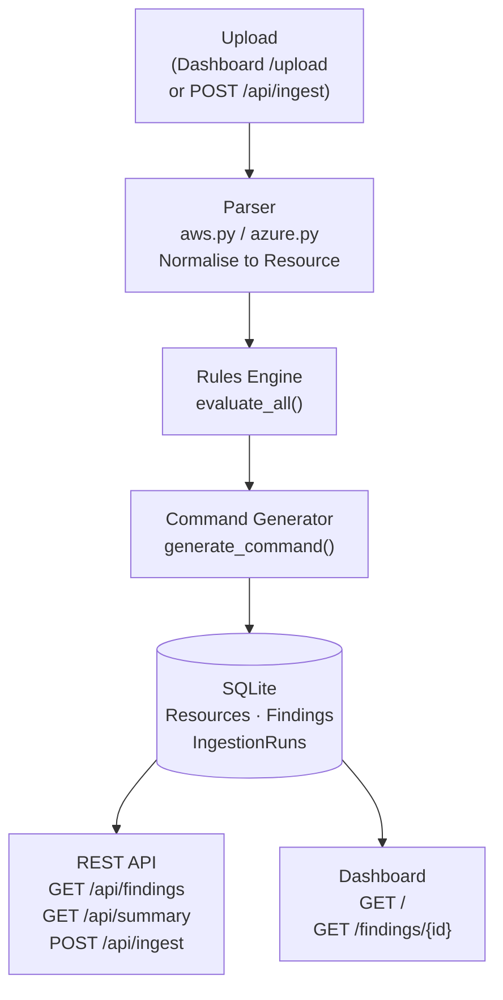

# Cloud Cost Optimizer — Walkthrough Deck

---

## Slide 1 — Title

# Cloud Cost Optimizer and Remediation Engine

**Samuel Ramdas**

> Ingest AWS and Azure billing exports, detect orphaned resources with a rules engine, and generate ready-to-review decommission commands — served through a REST API and an HTMX dashboard.

---

## Slide 2 — The Problem

### Cloud waste is invisible until you look for it

- **$10–15B+** in estimated annual cloud waste industry-wide (Gartner, Flexera State of the Cloud)
- Orphan resources accumulate silently:
  - Engineers spin up volumes, snapshots, and IPs — rarely clean up
  - Resource lifetimes outlive the projects that created them
  - Billing exports flag cost, but not *why* a resource exists
- Three common failure modes:
  - **Detached** — EBS volume persists after instance is terminated
  - **Idle** — VM running at 1% CPU for six weeks
  - **Forgotten** — snapshot from a DR test 18 months ago, never deleted
- In large estates, low-severity orphans alone can run to **hundreds of thousands per year**

---

## Slide 3 — Approach

### Architect-and-direct vibe coding

- **Constraint:** No manual edits — all logic directed through natural-language prompts
- **What that means in practice:**
  - The human acts as architect and product owner, not typist
  - Every decision — schema shape, fixture structure, API contract — is surfaced before committing
  - `prompts.md` captures the full chronological audit log of every decision
- **Why it works:**
  - Forces explicit articulation of requirements before implementation
  - Keeps the AI from making silent design choices
  - The audit log doubles as a specification document
- **Stack chosen:** Python 3.12 · FastAPI · SQLAlchemy 2.0 · SQLite · Jinja2 + HTMX · Tailwind · pytest

---

## Slide 4 — Architecture



- Ingest is a single synchronous pipeline: **parse → evaluate → command → persist**
- API and dashboard are independent read paths from the same database
- No background workers, no queues — intentionally simple for the MVP

---

## Slide 5 — Normalised Schema

### Why a common `Resource` model matters

**The problem:** AWS CUR has 30+ columns. Azure EA exports have 27 fields. Different names, different structures, different concepts of "region."

**The solution:** both parsers emit the same `Resource` shape:

| Field | Purpose |
|-------|---------|
| `provider` | `"aws"` or `"azure"` |
| `resource_type` | Normalised type (`ebs_volume`, `managed_disk`, …) |
| `region` | Canonical region string |
| `resource_id` | Provider-native ID or ARM path |
| `monthly_cost_usd` | Aggregated cost, normalised to USD |
| `tags` | Key-value dict, provider-agnostic |
| `raw_export` | Full original row — preserved for rule evidence |

- Rules are written **once** and run against both providers
- New providers require only a new parser, not new rules
- `raw_export` retention means rules can reach into provider-specific fields without polluting the schema

---

## Slide 6 — Rules Engine

### Four rules, one interface

```python
class Rule(ABC):
    name: str
    severity: Literal["low", "medium", "high"]
    def evaluate(self, resource: Resource) -> Finding | None: ...
```

| Rule | Signal | Severity |
|------|--------|----------|
| `UnattachedVolumeRule` | EBS `CreateVolume-Unattached` op; Azure disk `diskState == Unattached` | Medium |
| `IdleComputeRule` | `avg_cpu_percent < 5` over ≥ 14 days (from `raw_export` metrics) | High |
| `UnusedPublicIPRule` | Elastic IP `IdleAddress` usage type; Azure public IP with no `associatedResource` | Low |
| `OldSnapshotRule` | Snapshot creation date > 90 days ago (resolved from tags or `raw_export`) | Low |

**Evidence model:** every `Finding` records the exact field values that triggered it — not just a flag, but *why*.

- `evaluate_all()` wraps each rule in `try/except` — one bad rule never aborts the batch
- Adding a new rule: subclass `Rule`, register in the list, write two tests

---

## Slide 7 — Command Generation

### Ready-to-review, never auto-executed

Every finding gets a command string attached at ingest time:

**AWS — unattached EBS volume:**
```bash
# REVIEW BEFORE EXECUTING — flagged by UnattachedVolumeRule (severity: medium)
# Estimated monthly saving: $80.00
# Resource: vol-0b1b2c3d4e5f60003 | type: ebs_volume | region: us-west-2
# Dry-run available: append --dry-run to check permissions without making changes.
aws ec2 delete-volume --volume-id vol-0b1b2c3d4e5f60003 --region us-west-2
```

**Azure — unattached managed disk:**
```bash
# REVIEW BEFORE EXECUTING — flagged by UnattachedVolumeRule (severity: medium)
# Estimated monthly saving: $45.20
# Resource: /subscriptions/.../resourceGroups/prod-rg/providers/.../myDisk
az disk delete --name myDisk --resource-group prod-rg --yes
```

**Safety posture:**
- Comment header on every command: rule, severity, resource, saving
- `--dry-run` guidance added where the CLI supports it (EC2 commands)
- RDS deletion warns explicitly that `--skip-final-snapshot` has no recovery path
- `az network public-ip delete` has no `--yes` flag — documented, not invented

---

## Slide 8 — Dashboard

### What an operator does with it

Dashboard screenshot showing $229 monthly waste, 12 orphan findings across 50 resources, a doughnut chart by provider, and a filterable findings table sorted by estimated saving.


- **KPI row:** total waste estimate, orphan count, breakdown by provider and severity — at a glance
- **Doughnut chart:** waste proportion by cloud provider (Chart.js, CDN-loaded)
- **Filterable table:** provider / severity / rule dropdowns — HTMX swaps the table fragment without a full page reload
- **Detail page** (`/findings/{id}`): resource metadata, evidence JSON, decommission command in a code block with a copy-to-clipboard button
- **Upload form** (`/upload`): ingest a new export — redirects to the refreshed dashboard on success

**Operator workflow:**
1. Upload latest billing export
2. Sort findings by `Est. Saving / mo`
3. Open detail → review evidence → copy command → run in staging, then production

---

## Slide 9 — Results on Sample Data

### AWS CUR fixture: 50 resources, one ingest

| Metric | Value |
|--------|-------|
| Resources ingested | 50 |
| Findings generated | 12 |
| **Total est. monthly waste** | **$228.90** |
| Annualised projection | ~$2,747 |

**Breakdown by rule:**

| Rule | Findings | Severity |
|------|----------|----------|
| `UnattachedVolumeRule` | 4 | Medium |
| `UnusedPublicIPRule` | 4 | Low |
| `OldSnapshotRule` | 4 | Low |

**By region:**
- `us-west-2` — $108.60
- `us-east-1` — $82.20
- `eu-west-1` — $38.10

- 24% of the 50 resources are flagged as orphaned
- No `IdleComputeRule` hits: the fixture's EC2 instances lack CPU metrics — realistic, since CloudWatch data isn't in raw CUR exports

---

## Slide 10 — Where ML Extends This

### From rules to patterns

**Current approach:** hand-written threshold rules — deterministic, auditable, but brittle at the edges.

**Three natural ML extensions:**

1. **Clustering on utilisation patterns**
   - k-means or DBSCAN on `{cpu%, memory%, network_out, cost}` vectors per resource
   - Surfaces "idle-but-attached" resources that don't meet any single threshold rule
   - Trains on the `raw_export` metrics already captured in the schema

2. **Anomaly detection on cost trends**
   - LSTM or Prophet on per-resource monthly cost time series
   - Flags sudden cost spikes (e.g. a snapshot that grew 10× last month)
   - Complements rule-based detection with temporal signal

3. **NLP on tag hygiene**
   - Classify resources as "owner-identified", "project-linked", or "untagged"
   - Train on the `tags` JSON already normalised in the `Resource` schema
   - Low-confidence tags → prompt for owner verification before decommission

**Why the current schema supports this:** `raw_export` preserves full provider data; `monthly_cost_usd` is already normalised; `tags` is provider-agnostic. The pipeline already has the right inputs.

---

## Slide 11 — Workflow Reflections

### What the constraint revealed

**The no-manual-edits rule forced:**
- Every schema decision to be articulated before it was coded — no "I'll fix it in the file"
- Trade-offs to be surfaced explicitly: Python 3.14 incompatibility, fixture shape choices, API contract deviations
- A real audit log — `prompts.md` is 240+ lines of chronological decision history

**What `prompts.md` reveals:**
- The gap between "I want X" and "X requires these three decisions first"
- How much of software design is negotiation, not typing
- Where the AI made silent choices (Turn 8: fixture shape changed without prompting) — and why surfacing these matters

**What worked well:**
- Tests written in the same turn as implementation — no drift
- Architecture emergent from constraints, not upfront design
- The prompt log is the spec: if the code and the prompts disagree, the prompts win

**The honest trade-off:**
- Slower than writing the code yourself for trivial changes
- Dramatically faster for anything requiring cross-cutting consistency (schema, naming, test coverage)
- The constraint pays off most when the problem space is genuinely complex

---

*Deck generated as part of the Cloud Cost Optimizer build session. Full decision log: [`prompts.md`](prompts.md)*
